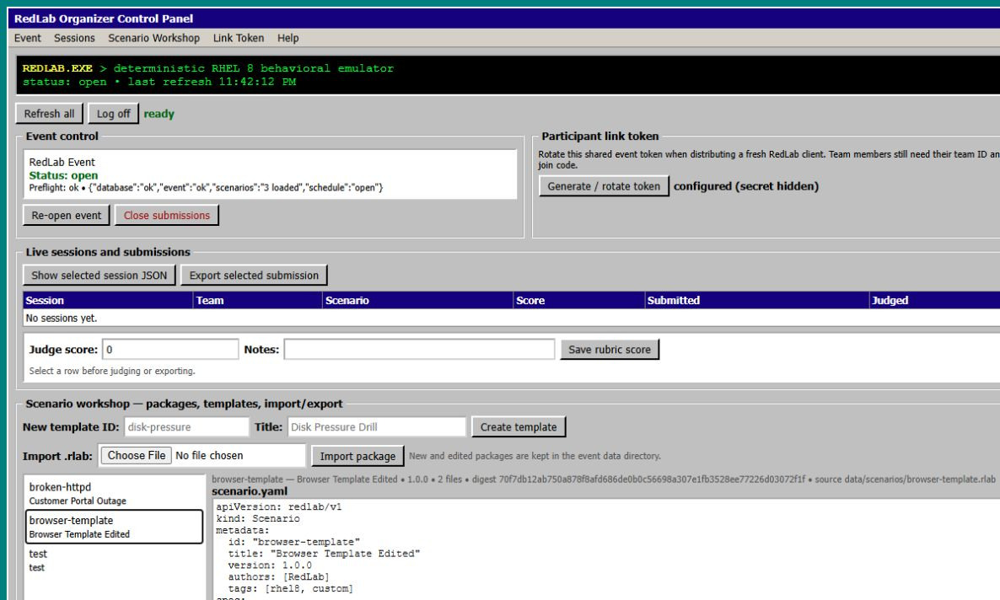
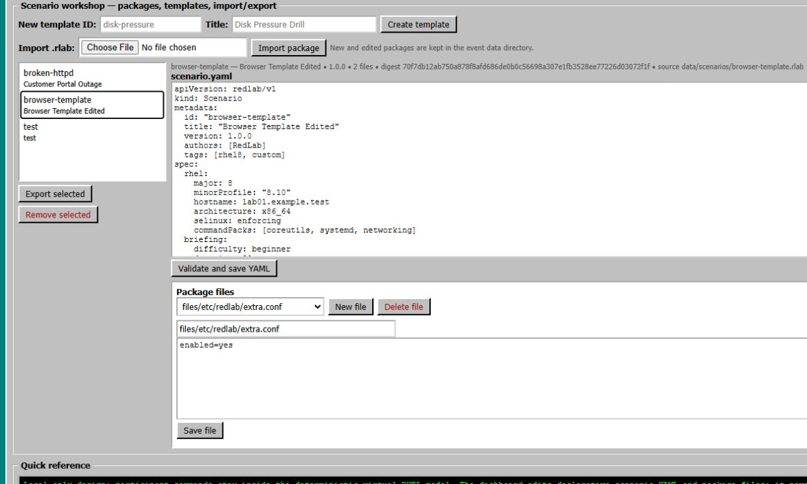
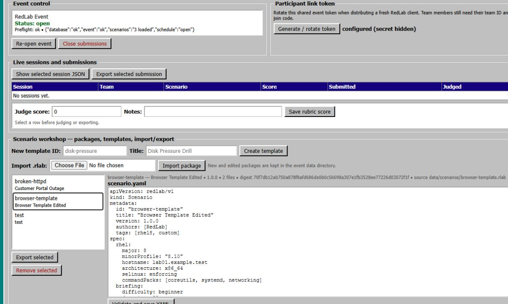
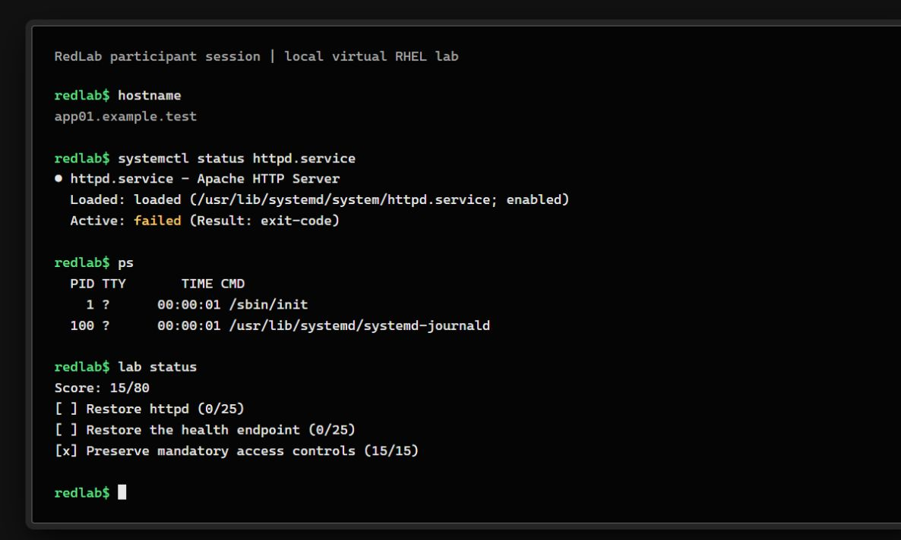

# RedLab

RedLab is a deterministic RHEL 8 behavioral emulator for troubleshooting and defensive-security hackathons. Participants operate inside a virtual RHEL-like machine: commands, files, services, users, packages, network state, logs, and time are simulated. RedLab never forwards participant commands to the host shell, maps virtual paths onto the host filesystem, or requires a real RHEL server.

The intended event model is local-first. Every participant can run the emulator on their own computer, complete a scenario, and send the signed submission bundle to the organizer. RedLab also contains an optional organizer backend for events that want coordinated remote sessions; the backend is not required for local play.

## 1. Pull the project locally from GitHub

Install Git, then clone the repository:

```powershell
git clone https://github.com/HorseTheUnicorn/RedLab.git
cd RedLab
```

If you already cloned the project and want the newest version:

```powershell
cd RedLab
git pull --ff-only origin master
```

The same Git commands work in Bash, macOS Terminal, and Linux shells. Run all `go run` and `go build` commands from the repository root, the directory containing `go.mod`.

## 2. Prerequisites

Required on every participant and organizer computer:

- Git 2.30 or newer.
- Go 1.26 or newer. The required version is declared in [`go.mod`](go.mod).
- A terminal. Windows PowerShell, macOS Terminal, and Linux shells are supported.

Not required:

- A RHEL installation.
- Docker, Podman, Kubernetes, or a virtual machine.
- A shared application server.
- Root or administrator privileges on the participant computer.

The first dependency download needs internet access. After Go has downloaded the module dependencies, local practice and bundle creation do not need a network connection.

Check the installation:

```powershell
git --version
go version
```

## 3. Download dependencies and build RedLab

From the repository root:

```powershell
go mod download
go run ./cmd/redlab version
```

The fastest way to run RedLab during development is with `go run`. To build a reusable binary on Windows:

```powershell
New-Item -ItemType Directory -Force .\bin | Out-Null
go build -trimpath -o .\bin\redlab.exe .\cmd\redlab
.\bin\redlab.exe version
```

On macOS or Linux:

```bash
mkdir -p bin
go build -trimpath -o ./bin/redlab ./cmd/redlab
./bin/redlab version
```

The binary is self-contained. It does not install a system service or modify the host operating system.

The first-party scenario packs are embedded in the binary. After building it, a participant can run a built-in pack without the repository or a separate download:

```powershell
.\bin\redlab.exe play broken-httpd
.\bin\redlab.exe play builtin:gitlab-service-recovery
```

Use a directory or `.rlab` archive when you are authoring or importing a custom package.

## 4. Verify a checkout

Run the normal repository checks before an event:

```powershell
go test ./...
go vet ./...
go run ./cmd/redlab event validate ./examples/event.yaml
```

Validate every core scenario in PowerShell:

```powershell
Get-ChildItem .\scenario-packs\core -Directory | ForEach-Object {
    go run ./cmd/redlab scenario validate $_.FullName
}
```

Run every scenario's deterministic reference repair:

```powershell
Get-ChildItem .\scenario-packs\core -Directory | ForEach-Object {
    go run ./cmd/redlab scenario test $_.FullName
}
```

On macOS or Linux, the equivalent loops are:

```bash
for scenario in scenario-packs/core/*; do
  go run ./cmd/redlab scenario validate "$scenario" || exit $?
done

for scenario in scenario-packs/core/*; do
  go run ./cmd/redlab scenario test "$scenario" || exit $?
done
```

The race test requires CGO and a working C compiler:

```powershell
go test -race ./...
```

If Go reports `-race requires cgo`, enable CGO and install a platform C toolchain, or use the regular test and vet commands above.

## 5. Run a local participant session

This is the recommended workflow for a distributed hackathon. No server is needed.

Start the built-in broken HTTP scenario:

```powershell
go run ./cmd/redlab play ./scenario-packs/core/broken-httpd --team TEAM-1 --export .\TEAM-1-submission.rlab.zip
```

Inside the RedLab prompt, begin with the briefing and inspect the virtual machine:

```text
lab briefing
hostname
id
systemctl status httpd.service
journalctl -u httpd.service
cat /etc/httpd/conf/httpd.conf
```

Repair the virtual machine using supported commands. A typical solution is:

```text
printf 'Listen 80\n' | sudo tee /etc/httpd/conf/httpd.conf
sudo systemctl start httpd.service
sudo firewall-cmd --add-service=http
curl http://app01.example.test/health
lab check
lab answer "The service configuration and public firewall rule were both incorrect."
lab answer "I repaired the configuration, started httpd, allowed HTTP, and verified the health endpoint."
lab submit
exit
```

`lab submit` must be entered before `exit`. The `--export` option writes the signed `.rlab.zip` only after a submission has been recorded. If you omit `--export`, the session remains local and no bundle is created.

Useful lab commands:

| Command | Purpose |
| --- | --- |
| `lab briefing` | Show the scenario summary and participant objectives. |
| `lab objectives` or `lab status` | Recalculate the current automated score. |
| `lab hint <id>` | Use a scenario hint and record its score cost. |
| `lab note <text>` | Save an observation in the report. |
| `lab answer <text>` | Save the root-cause explanation, then the resolution explanation. |
| `lab check` | Recalculate the automated score without submitting. |
| `lab evidence` | Verify the local evidence chain. |
| `lab reset` | Reset the virtual machine and session state. |
| `lab submit` | Mark the session ready for export or organizer review. |

Every path in that terminal is virtual. For example, writing `/etc/httpd/conf/httpd.conf` changes only the scenario state held by RedLab; it does not change the participant's real computer.

## 6. Verify and send a submission bundle

After leaving a session, verify the bundle before sending it to the organizer:

```powershell
go run ./cmd/redlab evidence verify .\TEAM-1-submission.rlab.zip
go run ./cmd/redlab submissions list .
```

The bundle contains the scenario digest, report, transcript, virtual state diff, timing, score information, and tamper-evident evidence events. Send the `.rlab.zip` through the event's approved file-transfer channel. Do not edit the archive after verification.

An organizer can review a bundle with:

```powershell
go run ./cmd/redlab evidence verify .\TEAM-1-submission.rlab.zip
go run ./cmd/redlab judge .\TEAM-1-submission.rlab.zip
```

## 7. Core scenario catalog

All core scenarios are deterministic, resettable, replayable, and safe to run locally. Product names describe the virtual packages and services represented by the scenario; they are not installed on the host computer.

| Scenario ID | Product or focus | Run command |
| --- | --- | --- |
| `broken-httpd` | RHEL HTTPD, firewalld, and SELinux | `go run ./cmd/redlab play ./scenario-packs/core/broken-httpd` |
| `atlassian-service-recovery` | Atlassian Jira and Confluence | `go run ./cmd/redlab play ./scenario-packs/core/atlassian-service-recovery` |
| `gitlab-service-recovery` | GitLab web service and GitLab Runner | `go run ./cmd/redlab play ./scenario-packs/core/gitlab-service-recovery` |
| `cascade-workflow-recovery` | Cascade workflow API and queue worker | `go run ./cmd/redlab play ./scenario-packs/core/cascade-workflow-recovery` |
| `drupal-site-recovery` | Drupal CMS and trusted-host configuration | `go run ./cmd/redlab play ./scenario-packs/core/drupal-site-recovery` |
| `compromised-account` | SSH access, scheduled-task persistence, and incident response | `go run ./cmd/redlab play ./scenario-packs/core/compromised-account` |
| `disk-inode-exhaustion` | Storage pressure and evidence preservation | `go run ./cmd/redlab play ./scenario-packs/core/disk-inode-exhaustion` |
| `identity-sudo-failure` | Identity state and scoped sudo access | `go run ./cmd/redlab play ./scenario-packs/core/identity-sudo-failure` |
| `network-outage` | Interfaces, DNS, routes, and firewalld | `go run ./cmd/redlab play ./scenario-packs/core/network-outage` |
| `package-configuration-drift` | RPM/DNF package and application configuration drift | `go run ./cmd/redlab play ./scenario-packs/core/package-configuration-drift` |

Use `--team TEAM-1 --export ./submission.rlab.zip` with any scenario when you want to identify the team and create a submission bundle.

## 8. Organizer setup for a local-only event

For the stated remote-team model, the simplest arrangement is for every team member to clone the same commit, run `play` locally, and send the resulting bundle to the organizer. The organizer does not need to install RedLab as a server.

Create an event workspace:

```powershell
go run ./cmd/redlab event init .\event
```

This creates:

- `event/event.yaml` — event schedule, scenario list, scoring, and server settings.
- `event/teams.csv` — team IDs and display names.
- `event/data/credentials.json` — hashed organizer and team credentials.
- `event/data/` — event-owned runtime data and submissions.

The command prints an organizer recovery secret, an event link token, and the initial `TEAM-1` join code. Store those securely; do not put them in source control, chat transcripts, or the public repository. The link token is a shared bootstrap credential for RedLab clients; it does not replace the team ID or team join code.

Edit `event/event.yaml` and add the scenario packages you want to use. Paths are resolved relative to `event.yaml`. From an event directory created in the repository root, entries can point to the built-in packs like this:

```yaml
scenarios:
  - {package: ../scenario-packs/core/atlassian-service-recovery, enabled: true}
  - {package: ../scenario-packs/core/gitlab-service-recovery, enabled: true}
  - {package: ../scenario-packs/core/cascade-workflow-recovery, enabled: true}
  - {package: ../scenario-packs/core/drupal-site-recovery, enabled: true}
```

Validate the event and all enabled packages:

```powershell
go run ./cmd/redlab event validate .\event\event.yaml
```

Generate additional team credentials. Use a prefix that does not overwrite the initial `TEAM-1` created by `event init`:

```powershell
go run ./cmd/redlab event teams generate .\event\teams.csv --count 40 --prefix HACK-
```

The command prints each generated team join code once. Give each team only its own code. Back up the event database during the event:

```powershell
go run ./cmd/redlab event backup .\event\event.yaml .\event\data\event-backup.db
```

For a serverless event, collect bundles from the teams and review them with `evidence verify`, `submissions list`, and `judge` as shown above.

When the organizer wants a browser control panel, start `serve` and open `http://127.0.0.1:8443/` (or the configured address). The panel uses the organizer recovery secret to log on and provides event close/reopen controls, live session and submission review, judging, submission export, scenario package management, and link-token rotation. It has no external JavaScript or CDN dependency.

### Screenshots

The organizer panel is served by the local RedLab process and has no external web-service dependency. These captures show the year-2000-style control panel, its scenario workshop, and the participant link-token controls. The token is intentionally hidden in the documentation capture; the real token is displayed once when it is generated or rotated.







Participants use the local console client rather than a host shell. Their commands run inside RedLab's bounded virtual RHEL environment:



## 9. Optional coordinated remote mode

Remote mode is optional. It is useful when the organizer wants session assignment, live session state, and server-side collection, but it is not needed when all participants run locally and exchange bundles.

Start on the organizer computer using the event configuration:

```powershell
go run ./cmd/redlab serve --event .\event\event.yaml
```

By default, the backend binds to loopback. For a LAN event, explicitly opt in to a LAN bind and use TLS:

```powershell
go run ./cmd/redlab serve --event .\event\event.yaml --lan --addr 0.0.0.0:8443
```

The generated event configuration uses generated TLS. RedLab prints the certificate fingerprint when the server starts. The organizer must separately configure the operating-system or network firewall to allow the selected port; RedLab does not alter the organizer firewall.

Give each participant the server URL, their team ID, their join code, and the printed certificate fingerprint:

```powershell
go run ./cmd/redlab join https://ORGANIZER-HOST:8443 --team HACK-1 --join-code TEAM-CODE --link-token EVENT-LINK-TOKEN --trust-fingerprint SHA256-FINGERPRINT
```

The participant still works in the same bounded virtual terminal. In remote mode, submissions are stored under the event's configured data directory. Never disable TLS just to make a LAN connection work; use the generated certificate or provide an organizer-managed certificate and key in `event.yaml`.

## 10. Command reference

Run `go run ./cmd/redlab --help` or `go run ./cmd/redlab <command> --help` for flags. The top-level commands are:

| Command | Purpose |
| --- | --- |
| `version` | Print the RedLab build and schema version. |
| `catalog commands` | List the versioned command compatibility catalog; filter with `--pack` or `--level`. |
| `play <scenario>` | Run a local participant session. |
| `scenario init <directory> [--id ID] [--title TITLE]` | Create a new scenario authoring template without recompiling. |
| `scenario validate <directory-or-package>` | Strictly validate a scenario. |
| `scenario test <directory-or-package>` | Run the reference solution, replay, reset, and guardrail checks. |
| `scenario pack <directory>` | Create a portable `.rlab` scenario archive. |
| `scenario inspect <package>` | Show package ID, title, version, digest, and file count. |
| `event init <directory>` | Create an organizer event workspace. |
| `event validate <event.yaml>` | Validate the event and each enabled scenario package. |
| `event teams generate <teams.csv>` | Create hashed credentials and a team CSV. |
| `event backup <event.yaml> <destination.db>` | Make a SQLite event database backup. |
| `serve --event <event.yaml>` | Run the optional organizer backend. |
| `join <server-url>` | Join a remote event as a team. |
| `status` | Inspect local or remote event/session status. |
| `submissions list [directory]` | List verified submission bundles. |
| `submissions export [directory]` | Copy verified bundles into an export directory. |
| `evidence verify <bundle>` | Verify the bundle archive and evidence chain. |
| `judge <bundle>` | Review or score judge-reviewed portions of a submission. |

The command catalog is deliberately bounded and versioned. A recognized command that is outside the implemented scenario depth returns an explicit unsupported result; it never falls back to the organizer's operating system.

## 11. Author or add a scenario

Create a new scenario entirely with the binary. This creates strict YAML plus an editable fixture directory; no Go source change or recompilation is required:

```powershell
go run ./cmd/redlab scenario init .\scenarios\my-scenario --id my-scenario --title "My RHEL Troubleshooting Drill"
```

Edit `scenario.yaml`, add or remove virtual fixture files under `files/`, then validate and test:

```powershell
go run ./cmd/redlab scenario validate .\scenarios\my-scenario
go run ./cmd/redlab scenario test .\scenarios\my-scenario
go run ./cmd/redlab scenario pack .\scenarios\my-scenario
```

The same workflow is available from the organizer dashboard. Log on, open **Scenario Workshop**, create a template or import a `.rlab` package, edit `scenario.yaml`, add/delete package files, validate/save, and export the package for another RedLab user. Scenario changes are locked once sessions exist so an event cannot change underneath participants.

The CLI package workflow is:

```powershell
go run ./cmd/redlab scenario export .\scenarios\my-scenario .\my-scenario.rlab
go run ./cmd/redlab scenario import .\my-scenario.rlab .\scenarios\teammate-copy
go run ./cmd/redlab scenario inspect .\my-scenario.rlab
```

Scenario YAML is strict: unknown fields and unsupported rule conditions fail validation. Files use safe virtual POSIX paths. Absolute host paths, `..` traversal, symlinks, duplicate archive entries, oversized files, and excessive archive expansion are rejected. A scenario package is immutable once an event starts.

The built-in product packs show how to model application incidents without installing those products:

- Atlassian Jira and Confluence connector drift and blocked HTTP access.
- GitLab external URL and Runner registration URL drift.
- Cascade queue-worker configuration and API reachability.
- Drupal trusted-host configuration and CMS reachability.

Use [`docs/authoring.md`](docs/authoring.md) for the complete schema and authoring boundary.

## 12. Safety and compatibility boundary

RedLab is designed to be safe for an untrusted participant command stream:

- The virtual shell is parsed by `internal/shell`; it is not the host shell.
- `internal/system` owns virtual files, services, identities, packages, network state, and time.
- Participant command paths contain no host process execution, host environment forwarding, host network dialing, or host filesystem mapping.
- Evidence chains and signed bundle manifests make post-event tampering detectable.
- Event credentials are stored as hashes, and refresh tokens are rotated and hashed.
- Sessions can be reset and replayed deterministically.

The emulator is not a full Bash or RHEL implementation. Run `catalog commands` to see the current compatibility level. Level A behavior is scenario-grade, Level B is common inspection, and Level C is recognized but intentionally unsupported at depth. Do not use RedLab as a general-purpose shell or as a replacement for production infrastructure.

## 13. Troubleshooting

`go` or `git` is not recognized: install Git and Go, restart the terminal, and confirm `git --version` and `go version` work.

Dependency download fails: run `go mod download` from the repository root while internet access is available, then retry the local commands.

`scenario validate` cannot find a package: scenario paths in an event are relative to the event YAML file, not the current shell directory. Check the path with `event validate`.

`--export requires lab submit`: reopen the scenario, complete the repair, run `lab submit`, then exit. RedLab intentionally does not export unsubmitted sessions.

A service still fails after editing a file: run `systemctl status <unit>` and `journalctl -u <unit>`, check the exact file content with `cat`, then run `lab check`. Start conditions are evaluated against the virtual state, not the host.

Remote join fails with a certificate error: use the exact HTTPS URL and the fingerprint printed by `serve`. Confirm the organizer's LAN firewall allows the chosen port. The server must be started with `--lan` for a non-loopback bind.

The race test cannot start on Windows: install and enable a CGO-capable compiler, or run the regular `go test ./...` and `go vet ./...` checks.

## 14. Further documentation

- [`docs/participant-quickstart.md`](docs/participant-quickstart.md) — short participant instructions.
- [`docs/operations.md`](docs/operations.md) — event-day operations and bundle review.
- [`docs/authoring.md`](docs/authoring.md) — scenario package authoring.
- [`docs/judge-guide.md`](docs/judge-guide.md) — report and scoring review.
- [`docs/architecture.md`](docs/architecture.md) — component and storage architecture.
- [`docs/threat-model.md`](docs/threat-model.md) — host-isolation and trust boundaries.
- [`docs/command-compatibility.md`](docs/command-compatibility.md) — supported command catalog.
- [`docs/known-limitations.md`](docs/known-limitations.md) — current limitations and future hardening.

## License

See the repository license file when one is added.
